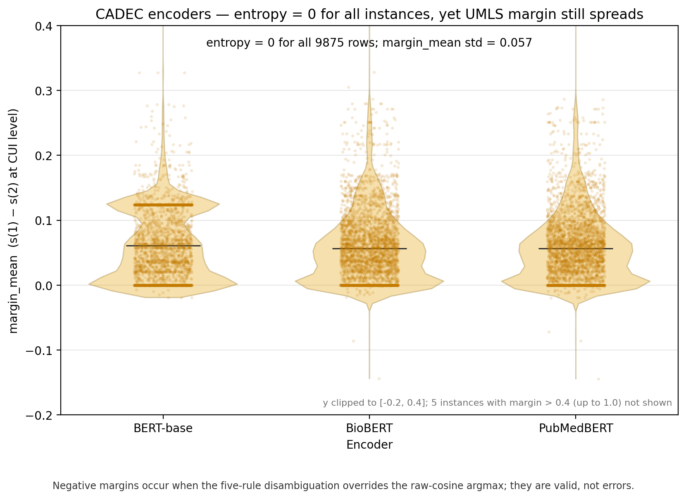

# RQ4 — Semantic entropy, UMLS margin, and selective prediction

## 1. The research question

Can UMLS-grounded semantic entropy rank concept-normalisation instances for selective prediction (abstention), and does the UMLS candidate margin add reliability information beyond entropy and mapping confidence?

**Grid.** 8 models × 2 concept datasets (MedMentions = biomedical literature; CADEC = patient-generated health text) plus a separate answer-level QA lane (BioASQ, SQuAD). Encoders were never run on QA.

## 2. What the graphs measure, and how we compute it

Each instance is a mention (concept lane) or a question (QA). Four meaning-preserving rewrites are kept only if they pass a six-gate screen; entropy is computed only when \(m \ge 3\). Concept-lane outputs are mapped to UMLS CUIs (SapBERT/FAISS); same CUI = same meaning. QA answers are clustered by NLI, not UMLS.

**Semantic entropy** is Shannon entropy of that cluster histogram, reported as \(H_{\mathrm{norm}} = H / \log_2(m+1)\) in \([0,1]\). Low = stable = safer for keeping. When \(H_{\mathrm{norm}}=0\), entropy cannot rank that instance against any other zero-entropy instance.

**Mapping confidence** is the SapBERT cosine of the winning CUI. On MedMentions encoders the model emits a CUI directly, so this score is the constant 1.0 (degenerate ranker). The QA lane uses sequence log-probability instead.

**UMLS margin** is \(s(1)-s(2)\): winning-CUI cosine minus the best cosine of a *different* CUI (CUI-level, mean over perturbations). High = safer. Concept lane only — not defined for QA answers. On MedMentions encoders this gap is taken from the **input mention span** (mention difficulty / restored retrieval), not a model-uncertainty axis.

Instances are ranked safest→riskiest; **coverage** is the fraction kept; **risk** \(= 1-\) selective accuracy on the kept set. **AURC** is the trapezoid of risk against coverage (**lower is better**). **Random** is the mean curve of 20 seeded permutations.

Two combiners: **Entropy, then confidence if tied** (lexicographic), and **Mean rank of entropy + confidence + margin** (equal-weight rank-mean; needs a defined margin).

| Quantity | What it is | Safe direction | Caveat |
|---|---|---|---|
| \(H_{\mathrm{norm}}\) | \(H/\log_2(m+1)\) over CUI (or NLI) clusters | low | cannot rank inside \(H=0\) |
| Mapping confidence | SapBERT cosine of winning CUI | high | ≡ 1.0 on MedMentions encoders |
| Sequence log-prob | QA confidence | high | concept lane unused |
| UMLS margin \(s(1)-s(2)\) | CUI-level candidate gap | high | not computed in QA; MM-encoder = mention-span gap |
| Risk / coverage / AURC | error on kept set; fraction kept; trapezoid | lower AURC | concept-lane and QA-lane AURC are not comparable |
| Random | mean of 20 permutations | baseline | — |

**Figure 1.** MedMentions concept-level risk–coverage (all 8 models).

Look at: the three encoder panels include mapping confidence (flat, degenerate) and UMLS margin as an input-mention-span gap; the five generative panels are the abstention ranking that Table 1 scores.

**Figure 2.** CADEC concept-level risk–coverage (all 8 models).

Look at: encoder UMLS margin (orange) sits *above* random; OpenBioLLM is \(n=233\) defined-margin rows only (SMALL; collapse cell).

**Figure 3.** BioASQ answer-level risk–coverage (5 generatives, \(n=392\)).

Look at: four series only — no UMLS margin, no 3-signal combiner.

**Figure 4.** SQuAD answer-level risk–coverage (5 generatives, \(n=139\), SMALL).

Look at: same four QA signals; thin \(n=139\); not comparable to the concept lane.

**Figure 5.** Concept-lane AURC (MedMentions top, CADEC bottom; lower is better).

Look at: purple 3-signal bars on the five MedMentions generatives and on CADEC FLAN-T5; CADEC-encoder orange (margin) is the tallest bar in those three groups.

**Figure 6.** QA-lane AURC (BioASQ top, SQuAD bottom; lower is better).

Look at: four bars per model; encoders omitted (never run on QA); not comparable to Figure 5.

## 3. Tables

**Table 1.** Concept-lane AURC (lower is better). **Win** = 3-signal combiner strictly below the 2-signal combiner *and* the best single. Counted wins: **5 MedMentions generatives + 1 CADEC (FLAN-T5)** — not 8/13. Llama-3 CADEC is a \(10^{-5}\) tie (excluded). OpenBioLLM CADEC (\(n=233\)) is a collapse cell (excluded).

| Dataset | Model | \(n\) | Semantic entropy | Mapping confidence | UMLS margin | Random (no ranking) | Entropy, then confidence if tied | Mean rank of entropy + confidence + margin | Note |
|---|---|---:|---:|---:|---:|---:|---:|---:|---|
| MedMentions | BERT-base | 491 | 0.864 | 0.866 | 0.811 | 0.865 | 0.864 | 0.823 | encoder; mention-span margin |
| MedMentions | BioBERT | 491 | 0.818 | 0.841 | 0.745 | 0.833 | 0.818 | 0.756 | encoder; mention-span margin |
| MedMentions | PubMedBERT | 491 | 0.874 | 0.876 | 0.830 | 0.869 | 0.874 | 0.841 | encoder; mention-span margin |
| MedMentions | FLAN-T5 | 491 | 0.673 | 0.668 | 0.629 | 0.710 | 0.644 | **0.612** | **win** |
| MedMentions | BioMistral-7B | 491 | 0.704 | 0.650 | 0.631 | 0.703 | 0.666 | **0.610** | **win** |
| MedMentions | Mistral-7B | 491 | 0.677 | 0.637 | 0.635 | 0.710 | 0.643 | **0.606** | **win** |
| MedMentions | OpenBioLLM-8B | 491 | 0.627 | 0.585 | 0.605 | 0.687 | 0.607 | **0.555** | **win** |
| MedMentions | Llama-3-8B | 490 | 0.682 | 0.672 | 0.638 | 0.703 | 0.659 | **0.625** | **win** |
| CADEC | BERT-base | 5669 | 0.492 | 0.453 | 0.760 | 0.617 | 0.443 | 0.556 | encoder; margin \(>\) random |
| CADEC | BioBERT | 5669 | 0.361 | 0.358 | 0.644 | 0.530 | 0.325 | 0.372 | encoder; margin \(>\) random |
| CADEC | PubMedBERT | 5669 | 0.364 | 0.352 | 0.653 | 0.534 | 0.322 | 0.373 | encoder; margin \(>\) random |
| CADEC | FLAN-T5 | 5668 | 0.671 | 0.689 | 0.676 | 0.716 | 0.677 | **0.651** | **win** |
| CADEC | BioMistral-7B | 5658 | 0.631 | 0.636 | 0.681 | 0.682 | 0.632 | 0.638 | not a win |
| CADEC | Mistral-7B | 5633 | 0.496 | 0.442 | 0.544 | 0.578 | 0.447 | 0.458 | not a win |
| CADEC | OpenBioLLM-8B | 233 | 0.381 | 0.376 | 0.401 | 0.588 | 0.372 | 0.370 | collapse; not a win |
| CADEC | Llama-3-8B | 5193 | 0.456 | 0.360 | 0.397 | 0.572 | 0.361 | 0.360 | tie; not a win |

Entropy does not systematically beat confidence as a ranker (two CADEC-generative exceptions, both \(<0.02\): BioMistral-7B 0.631 vs 0.636; FLAN-T5 0.671 vs 0.689). CADEC-encoder margin is worse than random (0.760 / 0.644 / 0.653 vs 0.617 / 0.530 / 0.534).

**Table 2.** Spearman rank correlation of UMLS margin with entropy and with mapping confidence. Independence is claimed for **MedMentions generatives** only (\(\rho\) vs entropy in \([-0.07, 0.10]\), 4/5 n.s.; \(\rho\) vs confidence in \([0.25, 0.46]\)). MedMentions-encoder confidence is constant 1.0 (undefined \(\rho\)); their margin is mention-span difficulty, not an independent axis.

| Dataset | Model | \(\rho\)(margin, entropy) | \(p\) | \(\rho\)(margin, confidence) | \(p\) | \(n\) |
|---|---|---:|---:|---:|---:|---:|
| MedMentions | BERT-base | 0.08 | 0.062 | n/a | n/a | 491 |
| MedMentions | BioBERT | −0.03 | 0.502 | n/a | n/a | 491 |
| MedMentions | PubMedBERT | 0.05 | 0.241 | n/a | n/a | 491 |
| MedMentions | FLAN-T5 | −0.06 | 0.219 | 0.25 | 1.4e-08 | 491 |
| MedMentions | BioMistral-7B | 0.10 | 0.023 | 0.32 | 2.1e-13 | 491 |
| MedMentions | Mistral-7B | −0.02 | 0.592 | 0.27 | 6.0e-10 | 491 |
| MedMentions | OpenBioLLM-8B | −0.07 | 0.149 | 0.46 | \(<\)1e-15 | 491 |
| MedMentions | Llama-3-8B | −0.06 | 0.184 | 0.28 | 4.7e-10 | 490 |
| CADEC | BERT-base | 0.32 | \(<\)1e-15 | −0.27 | \(<\)1e-15 | 5669 |
| CADEC | BioBERT | 0.37 | \(<\)1e-15 | −0.36 | \(<\)1e-15 | 5669 |
| CADEC | PubMedBERT | 0.38 | \(<\)1e-15 | −0.39 | \(<\)1e-15 | 5669 |
| CADEC | FLAN-T5 | 0.18 | \(<\)1e-15 | −0.13 | \(<\)1e-15 | 5668 |
| CADEC | BioMistral-7B | 0.07 | 2.0e-08 | 0.14 | \(<\)1e-15 | 5658 |
| CADEC | Mistral-7B | 0.03 | 0.038 | 0.48 | \(<\)1e-15 | 5633 |
| CADEC | OpenBioLLM-8B | −0.70 | \(<\)1e-15 | 0.72 | \(<\)1e-15 | 233 |
| CADEC | Llama-3-8B | −0.54 | \(<\)1e-15 | 0.64 | \(<\)1e-15 | 5193 |

On MedMentions generatives, margin is rank-uncorrelated with entropy and only weakly-to-moderately tied to confidence.

**Table 3.** Zero-entropy blocks (`\(H_{\mathrm{norm}}=0\)`). Undefined `margin_mean` is dropped, not imputed.

| Subset | Rows with defined `margin_mean` | `margin_mean` std |
|---|---:|---:|
| CADEC encoders (BERT-base, BioBERT, PubMedBERT) | 9875 | 0.057 |
| All eight CADEC models | 22578 | 0.091 |

Inside the CADEC-encoder \(H=0\) block, entropy is identically uninformative; margin still varies (std 0.057) and can rank.
