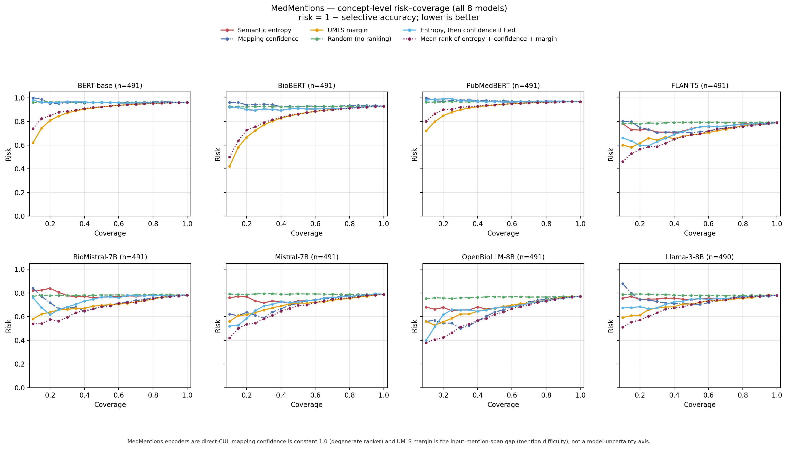
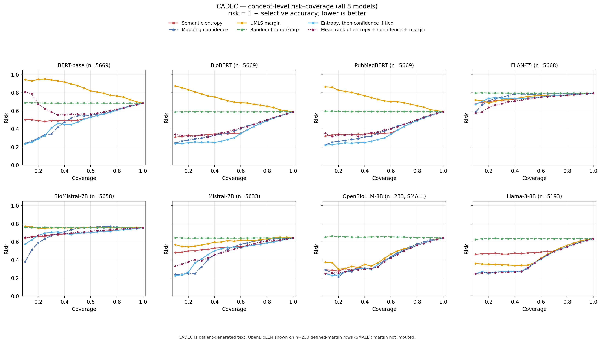
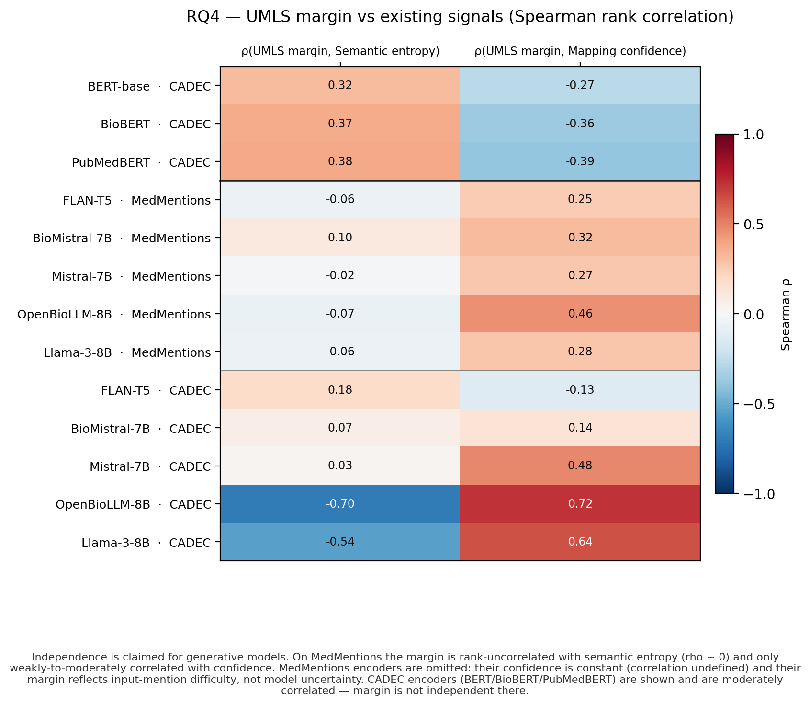
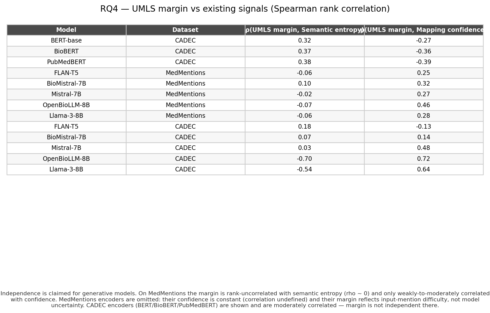
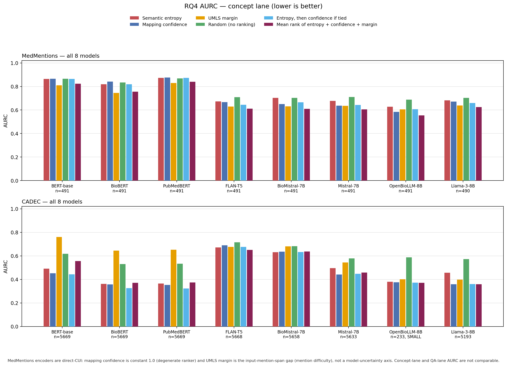
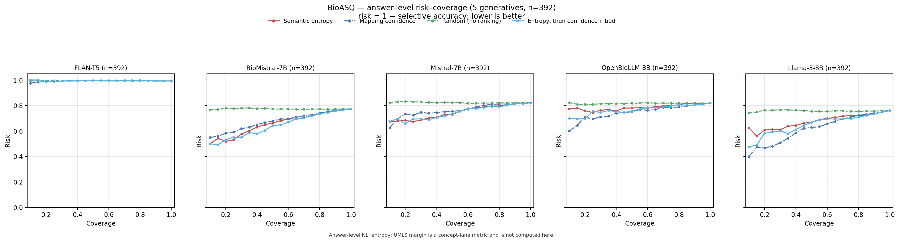
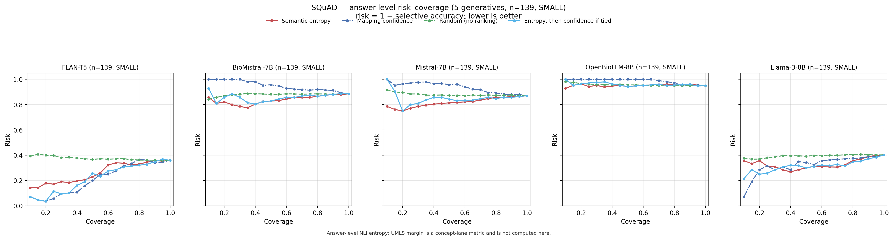
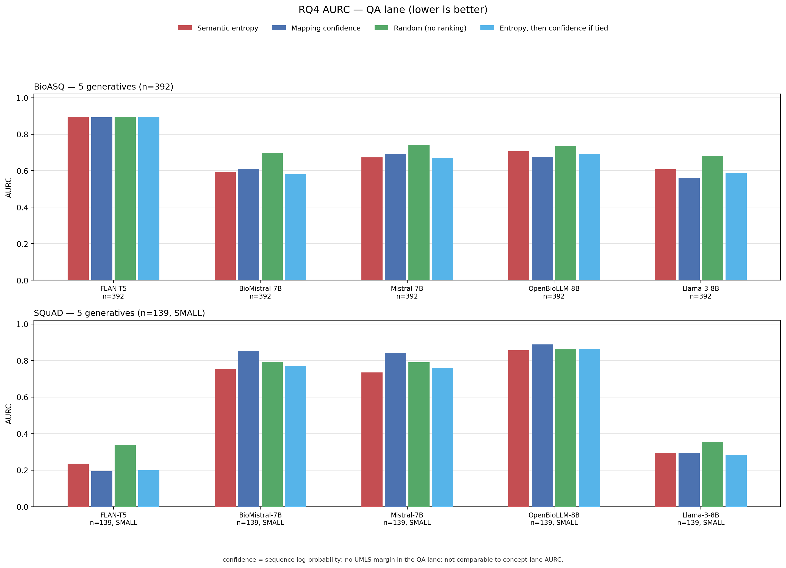

# 4.4 RQ4 — Selective prediction and the UMLS candidate margin

This note is a self-contained presentation of RQ4. Open this folder (`present/`) in any markdown preview: every figure is a local file under `figures/`. Numbers are those already verified in `RQ4_results_compiled.md`; nothing here is recomputed.

UMLS-grounded semantic entropy is tested as an abstention ranker for concept normalisation, and the CUI-level UMLS candidate margin \(s(1)-s(2)\) is tested as a second reliability axis. MedMentions is biomedical literature; CADEC is **patient-generated / consumer-health** text. The concept lane is not mixed with the answer-level QA lane (BioASQ, SQuAD2).

---

## Section 0. Metrics and how we compute them

Every instance is a mention (concept lane) or a question (QA lane). We rewrite the input with **four meaning-preserving perturbation methods**, then keep a rewrite only if it passes a **six-gate** validation screen. An instance enters the entropy calculation only if at least three perturbations survive: \(m \ge 3\). Fewer than three accepted rewrites means there is no distribution to take entropy over, so the instance is out.

On the concept lane each model output — original and perturbations — is mapped to a UMLS **Concept Unique Identifier (CUI)** with SapBERT embeddings retrieved in FAISS. Two strings count as the **same meaning** if and only if they receive the same CUI. Surface wording does not matter; CUI identity does.

**Semantic entropy** is the Shannon entropy of that CUI histogram. If an instance’s \(m\) accepted outputs fall into clusters \(s_i\) with empirical weights \(p(s_i)\),

\[
H = -\sum_i p(s_i)\,\log_2 p(s_i).
\]

We report the normalised form \(H_{\mathrm{norm}} = H / \log_2(m+1)\), which lives in \([0,1]\). **Higher entropy means less stable** (the model flips CUIs under harmless rewrites) and is treated as **riskier**. When every perturbation maps to one CUI, \(H_{\mathrm{norm}}=0\) and entropy cannot rank that instance against any other zero-entropy instance.

**Mapping confidence** is the SapBERT cosine of the winning CUI (mean-pooled over the forms that CUI contributed). On **MedMentions encoders** the model emits a CUI directly, so this score is the **constant 1.0** and cannot rank. On **CADEC** it is a real-valued retrieval cosine and can rank.

**UMLS candidate margin** asks how clearly the winning CUI beat the field. In the FAISS top-50, \(s(1)\) is the cosine of the winning CUI (the same number as stored confidence) and \(s(2)\) is the best cosine among forms of a **different** CUI. Then \(M_{\mathrm{UMLS}}=s(1)-s(2)\). We aggregate by the mean over the instance’s perturbations (`margin_mean`; primary). The gap is **CUI-level**, not surface-form: two forms of the same CUI do not count as a runner-up. Large margin = the winner sat well above every other concept = safer. On MedMentions encoders this gap is taken from the **input mention span** to the predicted CUI versus the next CUI: that is mention difficulty / restored retrieval confidence, not a generative uncertainty axis.

**Correctness** is a binary 0/1: the predicted CUI of the **original, unperturbed** input must equal the single normalised gold CUI. Unassigned predictions count as wrong.

**Selective prediction** ranks instances from safest to riskiest by a signal, keeps the top fraction (**coverage**, swept from 1.00 down to 0.10 in steps of 0.05), and measures error on the retained set. **Risk** \(= 1 -\) selective accuracy. **AURC** is the trapezoid of risk against coverage; **lower is better**. A **random** baseline is the mean risk–coverage curve of 20 seeded permutations of the same instances.

Signal directions: **low entropy = safe** (we invert entropy when ranking), **high confidence = safe**, **high margin = safe**.

Two combiners: the **2-signal lexicographic** ranker sorts by entropy first and uses confidence only to break ties; **`combined_3`** is the mean of percentile-rank-normalised entropy, confidence, and margin, computed within each (model, dataset).

The **QA lane** is a different process. Answer strings are clustered by a cross-encoder NLI model (`cross-encoder/nli-MiniLM2-L6-H768`; entailment index resolved to 1; threshold 0.72), not by UMLS. Confidence is **sequence log-probability**. Correctness is **exact match**. The UMLS candidate margin is **not computed**: answers need not map to UMLS concepts.

**Table 0.** Glossary of quantities used below.

| Quantity | What it is | Direction for abstention | Where it is undefined or dummy |
|---|---|---|---|
| \(m\) | Count of accepted perturbations after 6-gate validation | Instance kept only if \(m\ge 3\) | \(m<3\): no entropy |
| CUI cluster | Outputs with the same UMLS CUI (SapBERT/FAISS) | — | QA lane uses NLI clusters instead |
| \(H_{\mathrm{norm}}\) | \(H/\log_2(m+1)\), CUI (or NLI) histogram | Low = safe | Cannot rank inside \(H=0\) |
| Mapping confidence | SapBERT cosine of winning CUI | High = safe | Constant 1.0 on MedMentions encoders |
| Sequence log-prob | QA confidence | High = safe | Concept lane unused |
| \(M_{\mathrm{UMLS}}\), `margin_mean` | \(s(1)-s(2)\) at CUI level, mean over perturbations | High = safe | Not computed in QA; MM-encoder = mention-span gap |
| Correctness | Original predicted CUI \(=\) gold CUI (concept); exact match (QA) | — | Unassigned = wrong |
| Coverage | Fraction kept after ranking | Swept 0.10–1.00, step 0.05 | — |
| Risk | \(1-\)selective accuracy on the kept set | Lower = better ranking | — |
| AURC | Trapezoid(risk, coverage) | Lower = better | Concept-lane and QA-lane AURCs are not comparable |
| Random | Mean of 20 seeded permutations | Baseline | — |
| Lexicographic combiner | Entropy first; confidence breaks ties | — | — |
| `combined_3` | Mean of rank-normalised entropy, confidence, margin | — | Needs a defined margin |

---

## Q1. Does entropy alone suffice for abstention, or is confidence needed?

**Question** — Can semantic entropy, used alone, rank concept-normalisation instances for selective prediction, or is mapping confidence still required?

**Graph analysis**

Figure 1 (MedMentions generatives) plots coverage on \(x\) and risk on \(y\). Semantic entropy (red) and mapping confidence (blue) pull away from the flat random baseline (green) as coverage falls, but they do not share one lowest curve: on several panels confidence sits below entropy over much of the sweep, and entropy is not uniformly above random at low coverage. All series meet at coverage \(=1\). Figure 2 (CADEC) makes the encoder vs generative split visible. On BERT-base, BioBERT, and PubMedBERT, mapping confidence and the 2-signal combiner occupy the bottom of the panel; entropy is higher and flatter. On the CADEC generatives the red and blue curves stay close, with confidence at or below entropy on most panels other than FLAN-T5, where entropy and the 3-signal combiner sit lower at small coverage.

**Table analysis**

**Table 1.** AURC for entropy vs mapping confidence (lower is better), plus BioBERT / CADEC accuracy strata. MedMentions encoder rows are degenerate (confidence \(\equiv 1.0\)) and are labelled as excluded.

| Dataset | Model | \(n\) | AURC entropy | AURC confidence | Entropy lower? |
|---|---|---:|---:|---:|---|
| MedMentions | FLAN-T5 | 491 | 0.673 | 0.668 | no |
| MedMentions | BioMistral-7B | 491 | 0.704 | 0.650 | no |
| MedMentions | Mistral-7B | 491 | 0.677 | 0.637 | no |
| MedMentions | OpenBioLLM-8B | 491 | 0.627 | 0.585 | no |
| MedMentions | Llama-3-8B | 490 | 0.682 | 0.672 | no |
| CADEC | BERT-base | 5669 | 0.492 | 0.453 | no |
| CADEC | BioBERT | 5669 | 0.361 | 0.358 | no |
| CADEC | PubMedBERT | 5669 | 0.364 | 0.352 | no |
| CADEC | BioMistral-7B | 5658 | 0.631 | 0.636 | yes (\(\Delta=0.005\)) |
| CADEC | FLAN-T5 | 5668 | 0.671 | 0.689 | yes (\(\Delta=0.018\)) |
| MedMentions | BERT-base | 491 | 0.864 | 0.866 | degenerate — excluded |
| MedMentions | BioBERT | 491 | 0.818 | 0.841 | degenerate — excluded |
| MedMentions | PubMedBERT | 491 | 0.874 | 0.876 | degenerate — excluded |

| BioBERT / CADEC stratum | \(n\) | Accuracy |
|---|---:|---:|
| Zero-entropy block (\(H=0\)) | 3417 | 64.8% |
| Highest entropy quartile | 1417 | 2.3% |
| \(H=0\), bottom confidence quartile | 855 | 38.0% |
| \(H=0\), top confidence quartile | 854 | 75.6% |

Table 1 is the ranking summary of Figures 1–2. Entropy does not systematically outrank confidence — confidence is at least as good on every MedMentions generative and every CADEC encoder; the only exceptions are two CADEC generatives (BioMistral-7B 0.631 vs 0.636; FLAN-T5 0.671 vs 0.689), margins \(< 0.02\) AURC that we disclose but do not build on. The three MedMentions encoder cells where entropy appears to beat confidence are degenerate (confidence is the constant 1.0 of direct-CUI output) and are excluded, not counted as entropy wins. The strata still show that entropy is informative about correctness: BioBERT / CADEC accuracy is 64.8% when entropy is exactly zero and 2.3% in the highest entropy quartile. Inside that zero-entropy block entropy cannot rank, and confidence still can (38.0% vs 75.6%).

**Verdict** — **Entropy complements confidence but does not suffice for abstention. Confidence is at least as good a selective-prediction ranker on every MedMentions generative and every CADEC encoder; entropy remains useful as a correctness marker and as the first key in a lexicographic combiner, not as a replacement.**

---

## Q2. Is the UMLS candidate margin an independent signal (a new axis)?

**Question** — On generative concept normalisation, is UMLS candidate margin rank-correlated with entropy or confidence, or does it carry a distinct reliability axis?

**Graph analysis**

Figure 3 is a two-column heatmap, rows \(=\) model\(\times\)dataset. The MedMentions generative block is near white on \(\rho(\mathrm{margin},\mathrm{entropy})\) and light red on \(\rho(\mathrm{margin},\mathrm{confidence})\). The MedMentions encoder block is grey (n/a) on both columns. CADEC encoders are moderately red vs entropy and moderately blue vs confidence. CADEC OpenBioLLM (\(n=233\)) and Llama-3 are the dark cells: strongly negative vs entropy and strongly positive vs confidence. Figure 4 is the same matrix as a typeset table: grey n/a on MedMentions encoders, near-zero entropy correlations on MedMentions generatives. The independence claim is that pale MedMentions-generative block, not the encoder rows and not the CADEC collapse cell.

**Table analysis**

**Table 2.** Spearman \(\rho(\mathrm{margin},\mathrm{entropy})\) and \(\rho(\mathrm{margin},\mathrm{confidence})\) with two-sided \(p\) and \(n\). n/a \(=\) undefined (constant confidence).

| Dataset | Model | \(\rho(\mathrm{margin},\mathrm{entropy})\) | \(p\) | \(\rho(\mathrm{margin},\mathrm{confidence})\) | \(p\) | \(n\) |
|---|---|---:|---:|---:|---:|---:|
| MedMentions | BERT-base | 0.08 | 0.062 | n/a | n/a | 491 |
| MedMentions | BioBERT | −0.03 | 0.502 | n/a | n/a | 491 |
| MedMentions | PubMedBERT | 0.05 | 0.241 | n/a | n/a | 491 |
| MedMentions | FLAN-T5 | −0.06 | 0.219 | 0.25 | \(1.4\times10^{-8}\) | 491 |
| MedMentions | BioMistral-7B | 0.10 | 0.023 | 0.32 | \(2.1\times10^{-13}\) | 491 |
| MedMentions | Mistral-7B | −0.02 | 0.592 | 0.27 | \(6.0\times10^{-10}\) | 491 |
| MedMentions | OpenBioLLM-8B | −0.07 | 0.149 | 0.46 | \(<10^{-15}\) | 491 |
| MedMentions | Llama-3-8B | −0.06 | 0.184 | 0.28 | \(4.7\times10^{-10}\) | 490 |
| CADEC | BERT-base | 0.32 | \(<10^{-15}\) | −0.27 | \(<10^{-15}\) | 5669 |
| CADEC | BioBERT | 0.37 | \(<10^{-15}\) | −0.36 | \(<10^{-15}\) | 5669 |
| CADEC | PubMedBERT | 0.38 | \(<10^{-15}\) | −0.39 | \(<10^{-15}\) | 5669 |
| CADEC | FLAN-T5 | 0.18 | \(<10^{-15}\) | −0.13 | \(<10^{-15}\) | 5668 |
| CADEC | BioMistral-7B | 0.07 | \(2.0\times10^{-8}\) | 0.14 | \(<10^{-15}\) | 5658 |
| CADEC | Mistral-7B | 0.03 | 0.038 | 0.48 | \(<10^{-15}\) | 5633 |
| CADEC | OpenBioLLM-8B | −0.70 | \(<10^{-15}\) | 0.72 | \(<10^{-15}\) | 233 |
| CADEC | Llama-3-8B | −0.54 | \(<10^{-15}\) | 0.64 | \(<10^{-15}\) | 5193 |

Table 2 puts numbers on Figures 3–4. On MedMentions generatives, \(\rho(\mathrm{margin},\mathrm{entropy})\) is \([-0.07, 0.10]\) with 4/5 tests not significant at \(\alpha=0.05\) (BioMistral-7B is the exception: \(\rho=0.10\), \(p=0.023\)). \(\rho(\mathrm{margin},\mathrm{confidence})\) is only weakly-to-moderately positive, \([0.25, 0.46]\). MedMentions encoder \(\rho(\mathrm{margin},\mathrm{confidence})\) is undefined because mapping confidence is the constant 1.0 of direct-CUI output; those rows are not part of the independence claim, and MedMentions encoder margin is input-mention-span difficulty / restored retrieval confidence, not a new model-uncertainty axis. CADEC OpenBioLLM (\(n=233\)) is a collapse cell: \(\rho=-0.70\) / \(+0.72\) are not read as a stability result.

**Verdict** — **On MedMentions generatives, UMLS candidate margin is an independent reliability axis: nearly rank-uncorrelated with entropy and only weakly-to-moderately correlated with confidence. That claim does not extend to MedMentions encoders (direct-CUI mention difficulty) or to the OpenBioLLM CADEC collapse cell.**

---

## Q3. Does adding the margin improve selective prediction (AURC)?

**Question** — Does combining margin with entropy and confidence lower AURC relative to the singles and to the 2-signal lexicographic combiner?

**Graph analysis**

Figure 5 is grouped bars, lower \(=\) better. On the MedMentions generative cluster (FLAN-T5 through Llama-3) the purple `combined_3` bar is the shortest in every group, below entropy, confidence, margin, random, and the cyan 2-signal combiner. On CADEC, purple is clearly shortest for FLAN-T5; on Llama-3 it is visually tied with confidence and cyan; OpenBioLLM is labelled \(n=233\). On the three CADEC encoders the orange margin bar is the *tallest*, above green random. The QA-lane AURC (no margin series) is read with the QA coverage graphs in Q5; it cannot contribute a margin win.

**Table analysis**

**Table 3.** Full concept-lane AURC. Wins (lowest `combined_3`, strictly below the 2-signal combiner and the best single) are marked. Llama-3 CADEC is a tie (excluded); OpenBioLLM CADEC is a collapse cell (excluded).

| Dataset | Model | \(n\) | entropy | confidence | margin | random | combined (lex.) | combined_3 | Note |
|---|---|---:|---:|---:|---:|---:|---:|---:|---|
| MedMentions | BERT-base | 491 | 0.864 | 0.866 | 0.811 | 0.865 | 0.864 | 0.823 | encoder; not a win |
| MedMentions | BioBERT | 491 | 0.818 | 0.841 | 0.745 | 0.833 | 0.818 | 0.756 | encoder; not a win |
| MedMentions | PubMedBERT | 491 | 0.874 | 0.876 | 0.830 | 0.869 | 0.874 | 0.841 | encoder; not a win |
| MedMentions | FLAN-T5 | 491 | 0.673 | 0.668 | 0.629 | 0.710 | 0.644 | **0.612** | **win** |
| MedMentions | BioMistral-7B | 491 | 0.704 | 0.650 | 0.631 | 0.703 | 0.666 | **0.610** | **win** |
| MedMentions | Mistral-7B | 491 | 0.677 | 0.637 | 0.635 | 0.710 | 0.643 | **0.606** | **win** |
| MedMentions | OpenBioLLM-8B | 491 | 0.627 | 0.585 | 0.605 | 0.687 | 0.607 | **0.555** | **win** |
| MedMentions | Llama-3-8B | 490 | 0.682 | 0.672 | 0.638 | 0.703 | 0.659 | **0.625** | **win** |
| CADEC | BERT-base | 5669 | 0.492 | 0.453 | 0.760 | 0.617 | 0.443 | 0.556 | margin \(>\) random |
| CADEC | BioBERT | 5669 | 0.361 | 0.358 | 0.644 | 0.530 | 0.325 | 0.372 | margin \(>\) random |
| CADEC | PubMedBERT | 5669 | 0.364 | 0.352 | 0.653 | 0.534 | 0.322 | 0.373 | margin \(>\) random |
| CADEC | FLAN-T5 | 5668 | 0.671 | 0.689 | 0.676 | 0.716 | 0.677 | **0.651** | **win** |
| CADEC | BioMistral-7B | 5658 | 0.631 | 0.636 | 0.681 | 0.682 | 0.632 | 0.638 | not a win |
| CADEC | Mistral-7B | 5633 | 0.496 | 0.442 | 0.544 | 0.578 | 0.447 | 0.458 | not a win |
| CADEC | OpenBioLLM-8B | 233 | 0.381 | 0.376 | 0.401 | 0.588 | 0.372 | 0.370 | collapse; excluded |
| CADEC | Llama-3-8B | 5193 | 0.456 | 0.360 | 0.397 | 0.572 | 0.361 | 0.360 | tie \(-3\times10^{-5}\); excluded |

Table 3 matches Figure 5. The rank-mean 3-signal combiner is strictly lowest on all five MedMentions generatives and on CADEC FLAN-T5 — **5 MedMentions generatives + 1 CADEC (FLAN-T5)**. Llama-3 CADEC `combined_3` minus best single is \(-3\times10^{-5}\) (a tie, excluded). OpenBioLLM CADEC is \(n=233\) defined-margin rows only (collapse cell, excluded). On CADEC encoders the 2-signal lexicographic combiner still drops AURC vs the best single (0.010 / 0.033 / 0.030), but adding margin to the 3-signal mean *raises* AURC because margin is worse than random there (Q5).

**Verdict** — **Adding margin by rank-mean improves selective prediction on 5 MedMentions generatives + 1 CADEC generative (FLAN-T5). Llama-3 CADEC is a \(10^{-5}\) tie and OpenBioLLM CADEC (\(n=233\)) is a collapse cell; neither is counted as a win.**

---

## Q4. Does the margin rank where entropy is blind (entropy \(= 0\))?

**Question** — When normalised entropy is exactly zero, does UMLS `margin_mean` still vary enough to rank instances that entropy cannot separate?

**Graph analysis**

![Figure 6. CADEC encoders with entropy \(= 0\) for every plotted instance: `margin_mean` still spreads. \(y\) clipped to \([-0.2, 0.4]\).](figures/rq4_h0_centrepiece_cadec_encoders.png)

Figure 6 is a per-encoder violin plus jitter of `margin_mean` on the CADEC encoder \(H=0\) subset. The mass sits between 0 and about 0.2, with a dense band at 0, a secondary BERT-base band near 0.12, a thin tail toward the clip at 0.4, and a few negative values. The on-plot annotation states entropy \(= 0\) for all 9875 rows and `margin_mean` std \(= 0.057\). There is no vertical entropy axis: every point is in the block where entropy is identically uninformative.

**Table analysis**

**Table 4.** Zero-entropy (`normalised_entropy` \(= 0\)) blocks on CADEC. Undefined `margin_mean` is dropped, not imputed.

| Subset | Rows with defined `margin_mean` | `margin_mean` std | Notes |
|---|---:|---:|---|
| CADEC encoders (BERT-base, BioBERT, PubMedBERT) | 9875 | 0.057 | Figure 6 |
| All eight CADEC models | 22578 | 0.091 | |
| Undefined margin dropped | 5456 | — | almost entirely OpenBioLLM CADEC |

Table 4 is the count behind Figure 6. On CADEC encoders, 9875 instances have entropy exactly 0 yet margin still has std 0.057. Across all eight models the defined-margin zero-entropy block is 22578 rows with std 0.091. The 5456 dropped rows are almost entirely the OpenBioLLM CADEC collapse, not an imputed fill.

**Verdict** — **Yes: inside the CADEC encoder zero-entropy block, UMLS margin still spreads (N \(= 9875\), std \(= 0.057\)) and can rank instances that entropy cannot.**

---

## Q5. Where does the margin *not* work (scope boundaries)?

**Question** — For which settings is UMLS candidate margin not an independent abstention signal — encoders, tight-retrieval CADEC, or the QA lane?

**Graph analysis**

Figure 7 is the CADEC risk–coverage grid with the orange margin series isolated by eye. On BERT-base, BioBERT, and PubMedBERT that series lies *above* the green random line across coverage: ranking by margin *increases* risk relative to no ranking. On CADEC generatives orange is mixed — near random on BioMistral, below random but above confidence on Mistral and Llama-3. OpenBioLLM is the SMALL \(n=233\) panel. This is the failure geometry for encoder margin on patient-generated CADEC text, not a second copy of the Q3 win.

### QA lane (grounding boundary)

The next three figures are the answer-level lane. They use NLI clusters, sequence log-probability, and exact-match correctness. They do **not** contain a UMLS-margin series.

Figures 8–10 are the grounding boundary, not a margin result. Figure 8 (BioASQ) has four series only: entropy, confidence, random, and entropy-then-confidence. FLAN-T5 is flat at risk \(\approx 1\); on the other four models random is the high dashed line and confidence often sits at or below entropy (clearest on Llama-3). Figure 9 (SQuAD2, \(n=139\)) splits: FLAN-T5 and Llama-3 start at low risk under confidence; BioMistral, Mistral, and OpenBioLLM sit near the top of the risk axis, with OpenBioLLM collapsed near 1. Figure 10 summarises the same ranking as bars: BioASQ AURC is high (\(\sim 0.6\)–\(0.9\)); SQuAD2 repeats the split. The footnote on all three states that UMLS candidate margin is a concept-normalisation metric and is not computed here.

That geometry matches the zero-inflation contrast. BioASQ answer-level entropy is zero for only 6.4–28.3% of instances, far below the 50–98% at the CUI level; SQuAD2 (thin, \(n=139\), illustrative) runs higher at 15.1–52.5% and is an aside. There is no \(H=0\) block of CUI-lane size to send a UMLS margin into, and no UMLS margin on the figure.

**Table analysis**

**Table 5.** CADEC encoder AURC: margin vs random (lower is better), plus the settings where margin is out of scope.

| Model | \(n\) | AURC margin | AURC random | Margin vs random |
|---|---:|---:|---:|---|
| BERT-base | 5669 | 0.760 | 0.617 | worse (\(+0.143\)) |
| BioBERT | 5669 | 0.644 | 0.530 | worse (\(+0.114\)) |
| PubMedBERT | 5669 | 0.653 | 0.534 | worse (\(+0.119\)) |

| Setting | What margin is (or is not) |
|---|---|
| MedMentions encoders | Direct-CUI output; stored mapping confidence \(\equiv 1.0\). Margin \(=\) cosine gap of the **input mention span** to the predicted CUI vs the next CUI — mention difficulty / restored retrieval confidence, **not** an independent model-uncertainty axis. |
| CADEC encoders | Mapping-confidence std 0.013 / 0.012 / 0.014 (mean 0.013). Residual variation exists, but margin AURC is **worse than random** (0.64–0.76 vs 0.53–0.62). |
| QA lane | Margin is not computed (Figures 8–10). BioASQ answer-level entropy is zero for only 6.4–28.3% of instances, far below the 50–98% at the CUI level; SQuAD2 (thin, \(n=139\), illustrative) runs higher at 15.1–52.5% and is an aside. |

Table 5 reads Figure 7: CADEC-encoder margin AURC is 0.64–0.76 against a random baseline of 0.53–0.62. That is a real failure, not a missing series. MedMentions encoder margin is a different object (input mention span, dummy confidence) and is never called an independent axis. Figures 8–10 confirm there is no UMLS margin to evaluate in QA; zero-inflation is also milder on BioASQ than at CUI level, so the H=0 ranking argument does not transfer.

**Verdict** — **UMLS margin does not work as an independent abstention signal on direct-CUI MedMentions encoders, is worse than random on CADEC encoders, and is undefined in the answer-level QA lane. OpenBioLLM CADEC (\(n=233\)) remains a collapse cell, not a counter-example.**

---

## Final verdict

Entropy complements but does not dominate confidence. It tracks CUI correctness (BioBERT / CADEC: 64.8% accuracy at \(H=0\) vs 2.3% in the high-entropy quartile) and still cannot replace mapping confidence as a selective-prediction ranker: confidence is at least as good on every MedMentions generative and every CADEC encoder, with only two small CADEC-generative AURC exceptions (\(<0.02\)) that are disclosed and not built on.

The UMLS candidate margin is an independent reliability axis for *generative* concept normalisation. On MedMentions generatives it is rank-uncorrelated with entropy (\(\rho\in[-0.07,0.10]\), 4/5 n.s.) and only weakly-to-moderately correlated with confidence (\(\rho\in[0.25,0.46]\)). It still spreads inside the block where entropy is identically zero (CADEC encoders: 9875 rows, std \(=0.057\); all-eight defined-margin: 22578 rows, std \(=0.091\)). Combined by rank-mean it gives the best abstention on **5 MedMentions generatives + 1 CADEC generative (FLAN-T5)**; Llama-3 CADEC is a \(10^{-5}\) tie and OpenBioLLM CADEC (\(n=233\)) is excluded.

That claim is honestly bounded. MedMentions encoder margin is input-mention-span difficulty / restored retrieval confidence, not a new axis. CADEC-encoder margin is worse than random. The QA lane never computes UMLS margin (Figures 8–10). The practical implication is a **margin-aware abstention policy for generative biomedical concept normalisation, gated by setting**.
